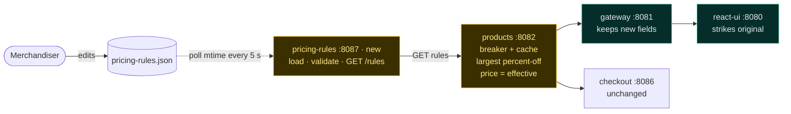
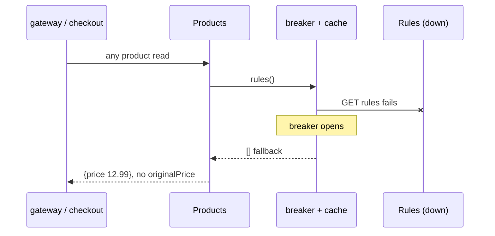
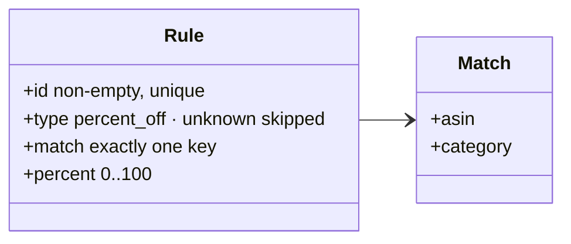

```mermaid {scale: 0.55}
flowchart LR
    R["requirements.md<br/>status: accepted"] --> C["read the code<br/>the criteria name"]
    C --> P["propose<br/>“Here's what I'm thinking…”"]
    P --> I["interview<br/>one topic at a time"]
    I --> W["for choices with no criterion:<br/>“why must it work this way?”"]
    W --> V["Validated Direction<br/>author signs off"]
    V --> D["design.md · tasks.md<br/>convention checks"]
    %% highlight classes (hex on purpose: Mermaid renders in a shadow DOM and cannot see tokens.css)
    classDef gold fill:#3b2f00,stroke:#fbbf24,color:#fde68a
    classDef mint fill:#052e2b,stroke:#6ee7b7,color:#e5e7eb
    classDef violet fill:#2a2450,stroke:#c4b5fd,color:#e5e7eb
    class P,I violet
    class W gold
    class V mint
```

Yugastore · .agents/skills/design-interview · invoked by design-spec, step 3

<h1 class="title small">A skill that makes the agent ask before it designs</h1>

Before <code>design-spec</code> writes a line of <code>design.md</code>, <code>design-interview</code> has to get the author to sign a Validated Direction.

<h3>The loop it enforces</h3>

<h3>Stops when it can answer three things</h3>
<ol class="three">
<li><b>What is the main approach?</b></li>
<li><b>What are the 1–2 constraints</b> the design must respect?</li>
<li><b>Which technology choices</b> differ from the default pattern?</li>
</ol>

Scale, risk, and integration probes are optional. Clear, small stories skip the interview.

<h3>What the author signs</h3>
<pre class="vd">## Validated Direction
**Approach:**            author-agreed summary
**Key Constraints:**     what the solution must respect
**Technology Decisions:** what and why
**Risk Areas:**          or "none"
**Rejected Alternatives:** or "none"
**Open Questions:**      or "none"</pre>

Mandatory sections map one-to-one onto <code>design.md</code>.

<h3>Why it exists</h3>

“…so that any downstream artifact reflects agreed-upon choices, <b>not agent-only assumptions</b>.”

agent-agnostic · Claude, Copilot, Codex
personas are skills
humans approve, agents recommend

.agents/skills/design-interview/SKILL.md · docs/process/collaboration.md, stage 21 of 3

<!--
This is the skill we wrote yesterday and dogfooded today. The key move: the agent cannot write design.md until the author has signed a Validated Direction. It proposes first, asks one topic at a time, and has to challenge any design choice that has no acceptance criterion behind it. The output template is the same shape as design.md, so nothing signed gets lost in translation.
-->

---

Yugastore · spec #2 · change pricing rules without a redeploy

<h1 class="title small">The design was interviewed into existence</h1>

One developer, one agent, fourteen questions over four rounds. The agent proposed, asked, taught when asked, and only then wrote <code>design.md</code>.

<h3>Pick the mechanics</h3>

<b>Agent:</b> Reload? Failure mode? Which diagrams?

<b>Travis:</b> Poll mtime every 5 s. <b>Resilience4j breaker.</b> Service map, scenarios, schema.

<b>Travis:</b> Price shape? <b>I want to brainstorm more</b> so I understand.

<h3>Agent pauses to teach</h3>

<b>Agent:</b> Today three readers use <code>price</code>. Option A overwrites it; B adds a field every reader must learn; C puts a second applier in checkout.

<b>Agent:</b> Comparison table: touchpoints × risk × semantics.

<b>Travis:</b> <b>A.</b> And keep the table for the deck.

<h3>Why must it work this way?</h3>

<b>Agent:</b> Listing rows only know one category. Gap or extra query?

<b>Travis:</b> Accept the gap. No gateway route. Typed rules file. Ties by file order.

<h3>Validated direction first</h3>

<b>Agent:</b> Approach, constraints, tech decisions, risks, rejected. Accurate?

<b>Travis:</b> Yes. Write design.md and tasks.md. Label the issue, hold the rest.

<b>Agent:</b> Convention check found a <b>spec drift</b>: 12 criteria on master, 13 mapped. Fixed and logged.

<b>14</b>questions asked

<b>11</b>alternatives rejected on record

<b>6</b>diagrams produced

<b>1</b>spec drift caught

<i style="background:var(--agent)"></i>agent<i style="background:var(--human)"></i>human<i style="background:var(--gold)"></i>the pivot

The round-2 artifact · how should the discounted price reach checkout?

<table>
<thead><tr><th>Option</th><th>Readers that must change</th><th>Risk if one is missed</th><th><code>price</code> means</th></tr></thead>
<tbody>
<tr class="pick"><td><b>A</b> · <code>price</code> effective + <code>originalPrice</code></td><td>storefront only, to show the original</td><td>none, the discount flows by default</td><td>effective price</td></tr>
<tr><td><b>B</b> · keep <code>price</code> base + <code>effectivePrice</code></td><td>storefront, cart, checkout, gateway</td><td>discount shown, full price charged</td><td>list price</td></tr>
<tr><td><b>C</b> · checkout applies rules too</td><td>storefront, checkout</td><td>two appliers drift on rounding or ties</td><td>effective price</td></tr>
</tbody>
</table>

docs/sessions/2026-09-16-pricing-rules-design/interview-log.md2 of 3

<!--
The point of this slide: the agent did not write and ask for approval. It asked first. The gold card is the moment Travis said "I want to brainstorm more" and the agent switched from recommending to teaching. Every bubble here is in the interview log verbatim.
-->

---

The proof · specs/pricing-rules-without-redeploy/design.md

<h1 class="title small">What the conversation produced</h1>

A file-driven rules service. Products applies the largest discount and keeps <code>price</code> effective, so checkout is correct unchanged.

<h3>Service map</h3>

<h3>Scenario 4 · rules service down</h3>

<h3>Rules file · room for BOGO</h3>

13 criteria → 13 mapping rows
9 one-commit tasks
4 scenario sequences
11 rejected alternatives
6 diagrams, all top-down and light-themed in the repo

branch pricing-rules-design-session · ADR 0002every criterion mapped, every task traces · 3 of 3

<!--
Walk the service map left to right: the merchandiser edits a file, the new service picks it up in under 30 seconds, products applies the discount, and everyone downstream just reads price. Then scenario 4: kill the rules service and the store keeps selling at base price. The class diagram shows the type field that leaves room for BOGO.
-->
