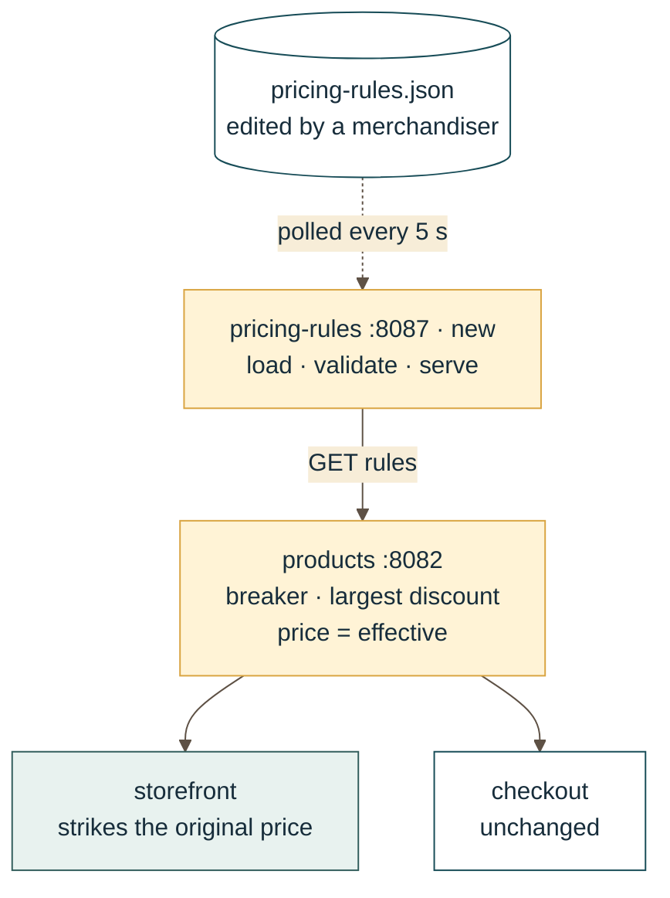

<div class="absolute inset-0 bg-[#071d2c]/78"></div>
<div class="absolute -right-14 -top-14 h-72 w-72 border-2 border-[#d9a441]/70 rounded-full"></div>
<div class="absolute right-15 top-15 h-40 w-40 border border-[#d9a441]/50 rounded-full"></div>

<div class="relative pt-18 text-[#fff7e6]">

# From Idea to<br>Buildable Story

<div class="mt-8 text-sm font-bold tracking-[0.18em] text-[#f0c96a]">AGENTIC WORKFLOWS FOR PROJECT DISCOVERY</div>
<div class="my-6 w-28 border-t-4 border-[#c85b3c]"></div>
<div class="text-lg leading-relaxed text-[#e7d7bb]"><strong class="text-[#fff7e6]">Pirate Brownpants</strong><br>Travis Redfield &middot; Laura Tuck &middot; Cody Cottson</div>
</div>

<!--
Welcome. We are Pirate Brownpants. This presentation covers the work we did to
create agentic workflows for the left side of software development: the period
where an idea becomes something a team can confidently build.

We will show the workflow, the durable artifacts it produces, and a short demo
where requirements discovery and a frontend prototype iterate on a storefront
redesign.
-->

---
class: bg-[#f7edd8] text-[#172d3b]
---


<div class="absolute inset-0 bg-[#f7edd8]/88"></div>
<div class="relative">

# The bottleneck: before code exists

<div class="mt-10 grid grid-cols-2 gap-12">
<div>
<div class="mb-5 flex h-14 w-14 items-center justify-center rounded-full bg-[#c85b3c] text-2xl text-white"><div class="i-carbon-chat"></div></div>
<div class="text-2xl font-bold text-[#174c57]">Intent gets scattered</div>

<div class="mt-7 space-y-3 text-lg text-[#5e5145]">
  <div>Meetings</div><div>Chat threads</div><div>Private AI sessions</div>
</div>
</div>

<div>
<div class="mb-5 flex h-14 w-14 items-center justify-center rounded-full bg-[#174c57] text-2xl text-white"><div class="i-carbon-renew"></div></div>
<div class="text-2xl font-bold text-[#174c57]">Teams reconstruct it later</div>

<div class="mt-7 space-y-3 text-lg text-[#5e5145]">
  <div>Developer assumptions</div><div>Tester questions</div><div>Rework</div>
</div>
</div>
</div>
</div>

<!--
We focused on a bottleneck before implementation starts. Requirements often
live across meetings, chat messages, and personal AI sessions. The author has
the context, but developers and testers reconstruct it later. That causes delay
and rework before the team ever has a code problem.
-->

---
layout: center
class: text-center bg-[#dceff0] text-[#172d3b]
---

# Our working thesis

<div class="mx-auto mt-10 max-w-3xl text-4xl font-bold leading-tight text-[#174c57]">Make intent durable, testable, and visible to the whole team.</div>

<div class="mx-auto mt-14 grid max-w-3xl grid-cols-3 gap-6 text-left">
  <div class="border-t-5 border-[#c85b3c] pt-4"><div class="text-xl font-bold text-[#174c57]">Shared</div><div class="mt-2 text-[#5e5145]">In the repo</div></div>
  <div class="border-t-5 border-[#d9a441] pt-4"><div class="text-xl font-bold text-[#174c57]">Testable</div><div class="mt-2 text-[#5e5145]">In criteria</div></div>
  <div class="border-t-5 border-[#174c57] pt-4"><div class="text-xl font-bold text-[#174c57]">Visible</div><div class="mt-2 text-[#5e5145]">In prototypes</div></div>
</div>

<!--
Our thesis is that AI helps teams most when it leaves behind a shared artifact,
not only a good answer in one session. We wanted requirements that are durable
in the repository, testable through clear criteria, and visible through a
prototype when words alone are not enough.
-->

---
class: bg-[#f7edd8] text-[#172d3b]
---

# A shared delivery loop

<div class="mx-auto mt-8 max-w-4xl space-y-10 text-center">
<div>
  <div class="mb-3 text-sm font-bold tracking-[0.16em] text-[#c85b3c]">AUTHOR LOOP</div>
  <div class="grid grid-cols-4 gap-2 text-base font-bold">
    <div class="border-2 border-[#c85b3c] bg-white/45 px-2 py-3">Idea</div>
    <div class="border-2 border-[#c85b3c] bg-white/45 px-2 py-3">Specify</div>
    <div class="border-2 border-[#c85b3c] bg-white/45 px-2 py-3">Design</div>
    <div class="border-2 border-[#c85b3c] bg-white/45 px-2 py-3">Build</div>
  </div>
</div>
<div>
  <div class="mb-3 text-sm font-bold tracking-[0.16em] text-[#174c57]">DEVELOPER LOOP</div>
  <div class="grid grid-cols-4 gap-2 text-base font-bold">
    <div class="border-2 border-[#d9a441] bg-white/45 px-2 py-3">Design</div>
    <div class="border-2 border-[#d9a441] bg-white/45 px-2 py-3">Build</div>
    <div class="border-2 border-[#d9a441] bg-white/45 px-2 py-3">Verify</div>
    <div class="border-2 border-[#d9a441] bg-white/45 px-2 py-3">Review</div>
  </div>
</div>
</div>

<div class="mt-12 border-l-5 border-[#315d5b] py-2 pl-5 text-lg text-[#5e5145]"><strong class="text-[#315d5b]">TEAM</strong> &nbsp; Repository artifacts, issue status, and PR evidence connect both loops.</div>

<!--
The workflow is idea, specify, design, build, verify, review, and done. Each
stage has a role, a clear input, a durable output, and a definition of done.
For each story, requirements.md is written by the author; design.md and
tasks.md are written by the developer. Issues and pull requests provide the
collaboration surface around those canonical files.
-->

---
class: bg-[#e8f2ef] text-[#172d3b]
---


<div class="absolute inset-0 bg-[#e8f2ef]/90"></div>
<div class="relative">

# Guided, not one-way

```mermaid {scale: 0.9, alt: 'Iterative workflow showing prototyping and feedback loops'}
flowchart LR
  S[Specify] --> D[Design] --> B[Build]
  S -. prototype .-> P[Visual spike]
  P -. feedback .-> S
  D -. questions .-> S
  B -. learning .-> D
  B -. scope .-> S
  classDef primary fill:#f5eadb,stroke:#a64b2a,color:#221510,stroke-width:2px;
  classDef feedback fill:#dcebe7,stroke:#315d5b,color:#16302e,stroke-width:2px;
  class S,D,B primary;
  class P feedback;
```

<div class="mt-7 border-l-5 border-[#c85b3c] py-2 pl-5 text-2xl font-bold text-[#174c57]">The path is linear. Learning is not.</div>
</div>

<!--
The handoffs give us a normal path, but this is deliberately not a waterfall.
Specification can request a visual spike. A design interview can uncover a
requirement that needs clarification. Building can reveal scope or design
questions. Stories may move backward; the point is to make iteration visible
and write learning back into the shared artifacts.
-->

---
class: bg-[#f7edd8] text-[#172d3b]
---


<div class="absolute inset-0 bg-[#f7edd8]/90"></div>
<div class="relative">

# The author flow
## From conversation to criterion

<div class="mt-8 grid grid-cols-2 gap-12">
<div>
<div class="mt-8 divide-y divide-[#cfbea5] text-xl">
  <div class="py-4"><b class="mr-5 text-[#c85b3c]">01</b>Plain-language interview</div>
  <div class="py-4"><b class="mr-5 text-[#c85b3c]">02</b>User story + boundaries</div>
  <div class="py-4"><b class="mr-5 text-[#c85b3c]">03</b>EARS acceptance criteria</div>
  <div class="py-4"><b class="mr-5 text-[#c85b3c]">04</b>Spec in the repository</div>
</div>
</div>

<div>
<div class="mb-5 border-l-4 border-[#d9a441] pl-4 text-sm italic leading-relaxed text-[#5e5145]">"Who is this for?"<br>"What should change?"<br>"What happens when it does not work?"</div>
```text
WHEN a shopper opens a product
card THE storefront SHALL show
the final price and promotion
before the original price.
```
<div class="mt-4 text-sm font-bold tracking-wide text-[#174c57]">ONE BEHAVIOR. ONE TESTABLE STATEMENT.</div>
</div>
</div>
</div>

<!--
The spec-writing agent begins with a plain-language interview. It asks about
the actor, desired outcome, boundaries, and failure cases. It turns the
conversation into a user story and EARS acceptance criteria: one observable
behavior per line. The requirements file is updated during the discussion, so
progress is not trapped in the session.
-->

---
class: bg-[#dceff0] text-[#172d3b]
---


<div class="absolute inset-0 bg-[#dceff0]/90"></div>
<div class="relative">

# Prototype before commitment

<div class="mt-8 grid grid-cols-2 gap-12">
<div>
<div class="mt-8 divide-y divide-[#a7c7c5] text-xl text-[#174c57]">
  <div class="py-4">01 &nbsp; Uncertain experience</div>
  <div class="py-4">02 &nbsp; Throwaway visual spike</div>
  <div class="py-4">03 &nbsp; Stakeholder reaction</div>
  <div class="py-4 font-bold text-[#c85b3c]">04 &nbsp; Better requirement</div>
</div>
</div>

<div>
<div class="mx-auto max-w-sm overflow-hidden border border-[#b9cfc9] bg-white shadow-lg">
  
  <div class="p-5"><div class="font-bold">Trail Running Shoe</div><div class="mt-2"><s class="text-[#75675c]">$129</s> <strong class="ml-2 text-2xl text-[#c85b3c]">$89</strong></div><div class="mt-2 text-sm font-bold tracking-wide text-[#174c57]">30% OFF</div></div>
</div>
</div>
</div>
</div>

<!--
When a question is visual or depends on a workflow, written requirements may
not be enough. The specification stage can request a delegated, throwaway
prototype on a scratch branch. Stakeholders review an actual experience rather
than infer it from text. Their feedback becomes acceptance criteria rather than
lost conversational context.
-->

---
class: bg-[#f7edd8] text-[#172d3b]
---


<div class="absolute inset-0 bg-[#f7edd8]/92"></div>
<div class="relative">

# Developer design iteration

<div class="mt-4 grid grid-cols-[minmax(0,1fr)_minmax(0,1.2fr)] gap-8 items-start text-sm">

<div>
  <div class="text-xs font-bold tracking-[0.18em] text-[#5e5145]">INPUT</div>
  <div class="mt-1 border-l-5 border-[#c85b3c] bg-white/55 px-3 py-2"><strong class="text-[#174c57]">requirements.md</strong> <span class="text-[#5e5145]">· accepted intent</span></div>

  <div class="my-1.5 ml-3 h-4 border-l-2 border-dashed border-[#d9a441]"></div>

  <div class="border-l-5 border-[#d9a441] bg-white/55 px-3 py-2">
    <strong class="block text-[#174c57]">design interview</strong>
    <div class="mt-1 space-y-0.5 text-[#5e5145]">
      <div><b class="mr-2 text-[#c85b3c]">1</b>propose first: "here's what I'm thinking…"</div>
      <div><b class="mr-2 text-[#c85b3c]">2</b>ask one topic at a time</div>
      <div><b class="mr-2 text-[#c85b3c]">3</b>challenge every choice with no criterion</div>
      <div><b class="mr-2 text-[#c85b3c]">4</b>author signs a Validated Direction</div>
    </div>
  </div>

  <div class="my-1.5 ml-3 h-4 border-l-2 border-dashed border-[#d9a441]"></div>

  <div class="text-xs font-bold tracking-[0.18em] text-[#5e5145]">OUTPUT</div>
  <div class="mt-1 border-l-5 border-[#174c57] bg-white/55 px-3 py-2"><strong class="text-[#174c57]">design.md</strong> <span class="text-[#5e5145]">· approach, diagrams, criteria mapping</span></div>
  <div class="mt-2 border-l-5 border-[#315d5b] bg-white/55 px-3 py-2"><strong class="text-[#174c57]">tasks.md</strong> <span class="text-[#5e5145]">· one commit each, traced to a criterion</span></div>

  <div class="mt-5 border-l-4 border-[#c85b3c] pl-3 text-base italic leading-snug text-[#c85b3c]">"Does this direction fit the system we have?"</div>
</div>

<div>
  <div class="text-xs font-bold tracking-[0.18em] text-[#5e5145]">WORKED EXAMPLE · SPEC #2, PRICING RULES</div>
  <div class="mt-1 flex justify-center rounded-lg border border-[#cce2df] bg-white/55 px-2 py-1">



  </div>
  <div class="mt-2 flex flex-wrap gap-2 text-xs">
    <span class="border border-[#d9a441] bg-[#fff3d6] px-2.5 py-1">14 interview questions</span>
    <span class="border border-[#174c57] px-2.5 py-1">13 criteria → 13 mapping rows → 9 tasks</span>
    <span class="border border-[#174c57] px-2.5 py-1">11 alternatives rejected on record</span>
  </div>
</div>

</div>
</div>

<!--
The developer starts from an accepted requirement and runs a design interview
to validate architecture, constraints, and technical direction. The agent
proposes first, asks one topic at a time, and has to challenge any design
choice that has no acceptance criterion behind it. Nothing is written until
the author signs a Validated Direction.

On the right is what that produced for the pricing-rules story: a new
file-driven rules service, products applies the discount and keeps price as
the effective price, so checkout is correct with no change. Gold boxes are
the services that change. Fourteen questions, one brainstorm when Travis asked
to understand the price-shape trade-off before choosing, thirteen criteria
each mapped to a design element and a task. The full interview log and the
design are on the branch.

A question that changes intent goes back to the author instead of becoming an
undocumented assumption in code.
-->

---
class: bg-[#174c57] text-[#fff7e6]
---

# Built for a team, not a chat

<div class="mt-12 grid grid-cols-4 gap-5">
  <div class="border-t-5 border-[#f0c96a] pt-4"><strong class="block text-xl">Repository</strong><span class="text-[#cce2df]">shared memory</span></div>
  <div class="border-t-5 border-[#f0c96a] pt-4"><strong class="block text-xl">Specs</strong><span class="text-[#cce2df]">source of truth</span></div>
  <div class="border-t-5 border-[#f0c96a] pt-4"><strong class="block text-xl">Issues</strong><span class="text-[#cce2df]">status + discussion</span></div>
  <div class="border-t-5 border-[#f0c96a] pt-4"><strong class="block text-xl">Pull requests</strong><span class="text-[#cce2df]">review + evidence</span></div>
</div>
<div class="mt-12 border-l-5 border-[#f0c96a] py-2 pl-5 text-xl font-bold text-[#f0c96a]">Canonical content is agent-agnostic. Tool files are adapters.</div>

<!--
This was designed for a team, not one productive chat session. The repository
is shared memory. The spec folder is the source of truth for each story. Issues
or a Jira equivalent track work and discussion, while pull requests hold review
and verification evidence. Canonical workflow content is agent-agnostic;
tool-specific files are thin adapters.
-->

---
layout: center
class: text-center bg-[#071d2c] text-[#fff7e6]
---


<div class="absolute inset-0 bg-[#071d2c]/65"></div>
<div class="relative">
# Demo

<div class="mx-auto mt-10 text-4xl font-bold leading-tight text-[#fff7e6]">A storefront redesign,<br>iterated in public</div>
<div class="mt-14 flex items-center justify-center gap-4 text-sm"><span class="border border-[#f0c96a] px-4 py-3">Request</span><b class="text-[#f0c96a]">-></b><span class="border border-[#f0c96a] px-4 py-3">Requirements</span><b class="text-[#f0c96a]">-></b><span class="border border-[#f0c96a] px-4 py-3">Prototype</span><b class="text-[#f0c96a]">-></b><span class="border border-[#f0c96a] px-4 py-3">Feedback</span><b class="text-[#f0c96a]">-></b><span class="border border-[#f0c96a] px-4 py-3">Spec</span></div>
</div>

<!--
For the demo we will use an intentionally incomplete storefront redesign
request. It gives us a visible change and a fast feedback loop. We will gather
initial requirements, create the structured spec, prototype the redesign,
review it as a stakeholder, and revise the requirement based on what the
prototype reveals.
-->

---
class: bg-[#f7edd8] text-[#172d3b]
---


<div class="absolute inset-0 bg-[#f7edd8]/90"></div>
<div class="relative">

# What we learned

<div class="mt-8 grid grid-cols-2 gap-12">
<div>
<div class="mt-7 space-y-6"><div class="border-l-5 border-[#c85b3c] pl-4"><b class="block text-xl text-[#174c57]">Artifacts beat answers</b><span class="text-[#5e5145]">Reusable context outlives a session.</span></div><div class="border-l-5 border-[#d9a441] pl-4"><b class="block text-xl text-[#174c57]">Prototype early</b><span class="text-[#5e5145]">Resolve visual ambiguity before build.</span></div><div class="border-l-5 border-[#174c57] pl-4"><b class="block text-xl text-[#174c57]">Keep humans accountable</b><span class="text-[#5e5145]">People own scope and sign-off.</span></div></div>
</div>

<div>
<div class="mt-4 border-t-5 border-[#c85b3c] bg-[#f0dfbf] p-7 text-xl leading-relaxed"><div class="text-xs font-bold tracking-[0.16em] text-[#c85b3c]">THE META-LEARNING</div><div class="mt-5">We built lightweight SDD infrastructure ourselves.</div><hr class="my-5 border-[#cbb18d]"/><div class="font-bold text-[#174c57]">Now we better understand why mature SDD tools exist.</div></div>
</div>
</div>
</div>

<!--
Agents provide team value when they create reusable artifacts rather than
one-off answers. Visual prototypes resolve ambiguity early, but people still
own prioritization, tradeoffs, and final sign-off.

Our meta-learning was that we largely built our own lightweight
spec-driven-development infrastructure: conventions, spec folders, handoffs,
and sync rules. Doing that work gave us a much clearer understanding of the
value mature SDD tools provide.
-->

---
layout: center
class: text-center bg-[#dceff0] text-[#172d3b]
---

# Q&A / Feedback

<div class="mx-auto mt-12 max-w-3xl text-4xl font-bold leading-tight text-[#174c57]">What would this workflow need to fit your project?</div>
<div class="mt-16 flex justify-center gap-8 text-lg text-[#5e5145]"><span class="border-t-4 border-[#c85b3c] pt-3">Where would it help?</span><span class="border-t-4 border-[#d9a441] pt-3">Where would it bend?</span><span class="border-t-4 border-[#174c57] pt-3">What would you measure?</span></div>

<!--
We would like feedback from the class. Which part would help most in your
project? Where would it need to adapt to your team and tools? What would you
measure to decide whether it is actually reducing friction?
-->

