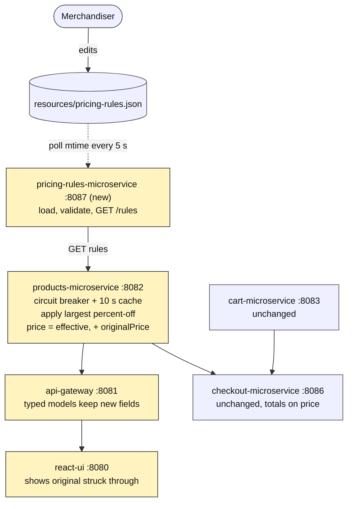
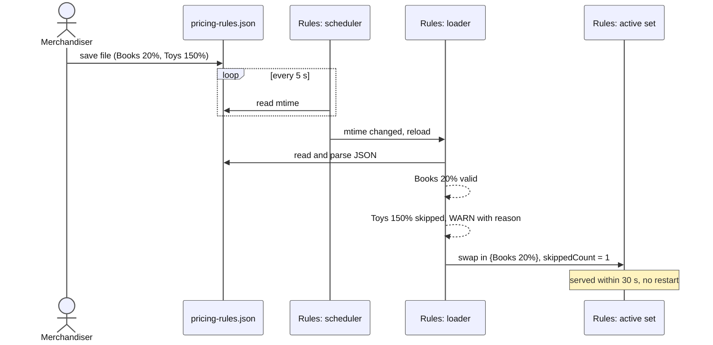
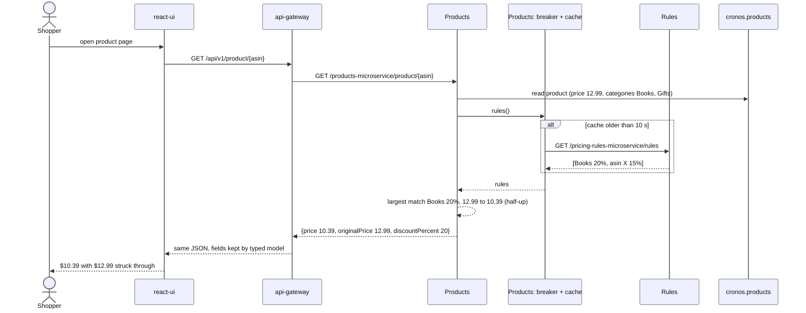
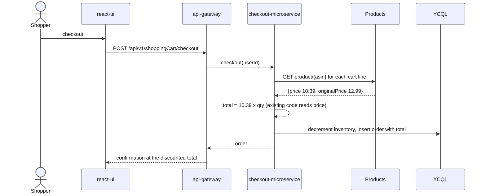
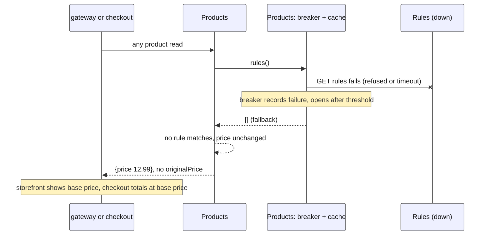
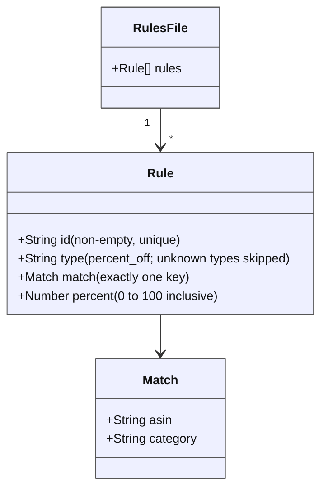

# Design: Change pricing rules without a redeploy

Designed 2026-09-16 through the `design-interview` skill. The interview
record, the author-validated direction, and the rejected options are in
`docs/sessions/2026-09-16-pricing-rules-design/`.

## Approach

A new file-driven rules service, and `products-microservice` applies its
rules so every consumer sees discounted prices through the `price` field
they already read.

- **New service.** A seventh module, `pricing-rules-microservice` (port
  8087, Eureka client, actuator, no database). It loads a JSON rules file
  from a configured path, validates each rule, polls the file's modification
  time every 5 seconds, swaps the rule set in memory when it changes, and
  serves the active rules from one GET endpoint.
- **Products is the only consumer.** It fetches rules through a Feign client
  wrapped in a Resilience4j circuit breaker with a 10 second in-memory cache,
  and applies the single largest matching percent-off rule to every product
  it returns. Ties go to the first rule in file order.
- **`price` becomes the effective price.** The response adds
  `originalPrice` and `discountPercent`, present only when a rule matched.
  Checkout, the cart page, and the storefront already read `price`, so they
  pick up discounted totals with no logic change.
- **Two edits in transit.** The gateway's typed product models gain the two
  fields so Jackson keeps them, and the storefront renders the original
  price struck through when it is present.
- **Outage means original prices.** When the breaker is open or the call
  fails, products applies an empty rule set. No stale discounts, matching
  both WHILE criteria.

**Service map.** Solid arrows are runtime calls, the dotted arrow is the
file poll. Shaded boxes change in this story; the rules service is new.



### Scenarios

One sequence per flow the test plan will exercise. `Rules` is
pricing-rules-microservice, `Products` is products-microservice.

**Scenario 1: a merchandiser changes a rule, and one rule is invalid.**



**Scenario 2: a shopper opens a discounted product page.**



**Scenario 3: checkout with a discounted product in the cart.**



**Scenario 4: the rules service is down.**



**Rules file shape.** One rule type today; `type` is where quantity-based
rules are added later without a format change.



## Touchpoints

| Service or file | Change |
|---|---|
| `pom.xml` | Add `pricing-rules-microservice` to `<modules>` |
| `pricing-rules-microservice/` (new) | Spring Boot 2.6.3 module, port 8087, Eureka client, actuator, no DB. `exec-maven-plugin` docker step for parity, skipped with `-Dexec.skip=true` like the others |
| `pricing-rules-microservice/.../RulesFileLoader` | Reads `pricing.rules.path` (default `../resources/pricing-rules.json`), parses JSON, validates each rule, WARN-logs and skips invalid ones, ERROR-logs and serves an empty set on missing file or invalid JSON |
| `pricing-rules-microservice/.../RulesRefreshScheduler` | `@Scheduled` every `pricing.rules.refresh-ms` (default 5000): compare mtime, reload on change, atomic swap |
| `pricing-rules-microservice/.../PricingRulesController` | `GET /pricing-rules-microservice/rules` returns `{rules:[...], loadedAt, skippedCount}` |
| `resources/pricing-rules.json` (new) | Sample rules: one category rule, one ASIN rule, one deliberately invalid rule for the test plan |
| `products-microservice/pom.xml` | Add `spring-cloud-starter-circuitbreaker-resilience4j` (Spring Cloud 2021.0.0 BOM already imported) |
| `products-microservice/.../rest/clients/PricingRulesRestClient` | `@FeignClient("pricing-rules-microservice")` with a fallback returning an empty list; `feign.circuitbreaker.enabled=true`; connect and read timeout 500 ms |
| `products-microservice/.../service/PricingRulesCache` | Caches the last successful rules for 10 s. Any failure or open breaker yields an empty list for that window |
| `products-microservice/.../service/PriceRuleApplier` | Pure function: (asin, categories, price, rules) to (price, originalPrice, discountPercent). Largest percent wins, file order breaks ties, half-up to 2 decimals |
| `products-microservice/.../domain/ProductMetadata`, `ProductRanking` | `@Transient originalPrice` (Double) and `discountPercent` (Integer), null when no discount |
| `products-microservice/.../controller/ProductCatalogController` | Apply the applier to every product in all three GET responses |
| `api-gateway-microservice/.../domain/ProductMetadata`, `ProductRanking` | Add the two fields so the typed pass-through keeps them |
| `react-ui/frontend/src/components/Products/index.js`, `ShowProduct/index.js` | When `originalPrice` is present, render it struck through beside `price` with a percent badge |
| `AGENTS.md` | New architecture row (8087, no API, hot-reloaded rules file); reword the read-only-catalog gotcha |
| `.agents/skills/setup-local/SKILL.md`, `start-app`, `stop-app` | Add the service to the start and stop order, the rules file path, and the 30 s propagation note |

`react-ui`'s Spring layer returns the gateway's JSON as a raw string, so its
Java model needs no change. Checkout and cart need no change: they read
`price`, which is now the effective price.

## Data

No YugabyteDB schema changes. The rules file is the only new data:

```json
{
  "rules": [
    {"id": "books-20", "type": "percent_off", "match": {"category": "Books"}, "percent": 20},
    {"id": "asin-deal", "type": "percent_off", "match": {"asin": "0001048791"}, "percent": 15},
    {"id": "bad-toys", "type": "percent_off", "match": {"category": "Toys"}, "percent": 150}
  ]
}
```

Validation: `id` non-empty and unique; `type` is `percent_off` (unknown
types skipped); `match` has exactly one of `asin` or `category`;
`percent` is a number in 0 to 100 inclusive. The third sample rule is
invalid on purpose so the skip path is visible in local dev.

**Where the file lives.** `pricing.rules.path` defaults to
`../resources/pricing-rules.json`, the checkout copy on the machine running
the service. Assumption carried from the spec Notes: a merchandiser has some
way to put a changed file on that host without a redeploy. That mechanism is
outside this story.

## Criteria mapping

| Criterion | How it is satisfied |
|---|---|
| THE pricing-rules-microservice SHALL load pricing rules from a JSON file at a path set in its configuration | `RulesFileLoader` reads `pricing.rules.path` at startup |
| WHEN the rules file changes on disk THE pricing-rules-microservice SHALL serve the new rules within 30 seconds without a restart | `RulesRefreshScheduler` polls mtime every 5 s and swaps the set atomically |
| THE pricing-rules-microservice SHALL return the active rules as JSON from a GET endpoint | `GET /pricing-rules-microservice/rules` |
| WHEN a product's ASIN matches a percent-off rule THE products-microservice SHALL return the discounted price and the original price in the product response | `PriceRuleApplier` ASIN match; `price` discounted, `originalPrice` set |
| WHEN a product belongs to a category with a percent-off rule THE products-microservice SHALL return the discounted price and the original price in the product response | `PriceRuleApplier` category match against `ProductMetadata.categories`; for `ProductRanking` rows, against the listed category only (accepted gap, see requirements Out of scope) |
| WHEN more than one percent-off rule matches a product THE products-microservice SHALL apply only the largest discount | Applier picks max `percent`; ties to first in file order |
| WHEN a product has a discounted price THE storefront SHALL show the discounted price and the original price on the product list and product page | Gateway keeps the fields; `Products` and `ShowProduct` render `originalPrice` struck through when present |
| WHEN an order is placed for a discounted product THE checkout-microservice SHALL total the order using the discounted price | Unchanged `CheckoutServiceImpl.getTotal` multiplies `price`, now the effective price |
| IF a rule has a percentage outside 0 to 100 or is missing a required field THEN THE pricing-rules-microservice SHALL skip that rule, log the reason, and serve the remaining rules | Per-rule validation in `RulesFileLoader`, WARN with rule index and reason, `skippedCount` in the response |
| IF the rules file is missing or is not valid JSON THEN THE pricing-rules-microservice SHALL log the reason and serve an empty rule set | Loader catches `NoSuchFileException` and `JsonProcessingException`, logs ERROR, serves `rules: []` |
| WHILE the pricing-rules-microservice is unavailable THE products-microservice SHALL return original prices with no discount | Breaker fallback and cache return an empty list; applier leaves `price` unchanged and `originalPrice` null |
| WHILE the pricing-rules-microservice is unavailable THE checkout-microservice SHALL total orders at original prices | Follows from the previous row: checkout reads `price` from products |
| THE products-microservice SHALL round a discounted price to the nearest cent, rounding half-up | `BigDecimal.setScale(2, RoundingMode.HALF_UP)` in the applier |

## Open questions

- The spec is `status: proposed` on `master` and overlaps
  `specs/promo-pricing/` (#1), which is in Build with a write path inside
  products-microservice. The author chose on 2026-09-16 to proceed on this
  branch for #2 only. The team must reconcile #1 and #2 before anything
  merges to `master`.

## Rejected alternatives

Each was discussed with the author during the design interview; the full
reasoning is in `docs/sessions/2026-09-16-pricing-rules-design/interview-log.md`.

- **Keep `price` as the base and add `effectivePrice`.** Every reader
  (checkout, cart, gateway, storefront) would have to switch fields; miss one
  and the page shows a discount while checkout charges full price.
- **Checkout applies rules itself.** Two appliers that must agree on
  rounding, ties, and outage behaviour. No criterion asks for checkout to be
  independent of products.
- **`appliedRuleId` in the response.** Useful for tracing, no criterion
  needs it.
- **`WatchService` for file changes.** Inconsistent on macOS and mounted
  volumes; a 5 s poll meets the 30 s criterion with margin.
- **Re-read the file on every request.** Fewer parts, but the scheduler is
  small and keeps the endpoint fast.
- **Bare Feign timeout without a breaker.** Same outcome, but the breaker
  ties to the client's graceful-degradation goal and is visible in a demo.
- **Serve last-known rules during an outage.** Both WHILE criteria say
  original prices.
- **Batched category lookup on listing pages.** Correct on every row, but
  adds a read to the busiest endpoint for a corner case. Recorded as a gap.
- **Gateway route for the rules endpoint.** Service-to-service only; the
  future write-API story adds gateway exposure.
- **Rules file inside the module jar; flat untyped rules.** The first weakens
  the no-redeploy story, the second ignores the spec's room-for-BOGO note.
- **Rules in YugabyteDB or a third-party CMS.** See
  `docs/decisions/0002-pricing-rules-service.md`.
