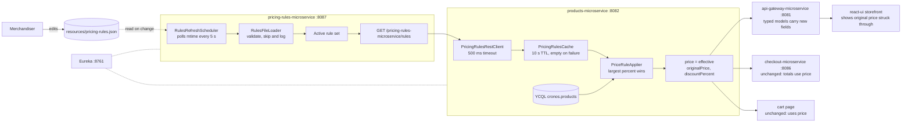

# Design: Change pricing rules without a redeploy

## Approach

Add a seventh module, `pricing-rules-microservice`, that loads a JSON rules
file from a configured path, re-reads it when the file's modification time
changes, and serves the valid rules over one GET endpoint. It has no database.
`products-microservice` fetches those rules through a Feign client with a short
timeout and a short in-memory cache, applies the single largest matching
percent-off rule to each product it returns, and reports the result by keeping
`price` as the effective price and adding `originalPrice` and
`discountPercent`. Because checkout, the cart page, and the storefront all
already read `price` from products-microservice, they pick up discounted
totals with no logic change; the storefront only needs to render the original
price when one is present, and the gateway's typed copies of the product models
need the two new fields so Jackson does not drop them in transit.



When the rules service is unreachable, the cache returns an empty rule set, the
applier leaves `price` untouched, and every consumer downstream sees original
prices.

## Touchpoints

| Service or file | Change |
|---|---|
| `pom.xml` | Add `pricing-rules-microservice` to `<modules>` |
| `pricing-rules-microservice/` (new) | Spring Boot 2.6.3 module, port 8087, Eureka client, actuator, no DB. `exec-maven-plugin` docker step included for parity, skipped by `-Dexec.skip=true` like the others |
| `pricing-rules-microservice/.../RulesFileLoader` | Reads `pricing.rules.path`, parses JSON, validates each rule, logs and skips invalid ones, serves an empty set on missing file or invalid JSON |
| `pricing-rules-microservice/.../RulesRefreshScheduler` | `@Scheduled` every `pricing.rules.refresh-ms` (default 5000): compare mtime, reload on change |
| `pricing-rules-microservice/.../PricingRulesController` | `GET /pricing-rules-microservice/rules` returns `{rules:[...], loadedAt, skippedCount}` |
| `resources/pricing-rules.json` (new) | Sample rules file with one category rule and one ASIN rule, used by local dev and the test plan |
| `products-microservice/.../rest/clients/PricingRulesRestClient` | `@FeignClient("pricing-rules-microservice")`, connect and read timeout 500 ms |
| `products-microservice/.../service/PricingRulesCache` | Wraps the client. Caches rules for 10 s. Any exception or timeout yields an empty rule list for that window (no stale-rule fallback, per the WHILE criteria) |
| `products-microservice/.../service/PriceRuleApplier` | Pure function: (asin, categories, price, rules) to (price, originalPrice, discountPercent, appliedRuleId). Largest percent wins; rounds half-up to 2 decimals |
| `products-microservice/.../domain/ProductMetadata`, `ProductRanking` | Add `originalPrice` (Double, null when no discount) and `discountPercent` (Integer, null when no discount) as `@Transient` fields so Spring Data Cassandra ignores them |
| `products-microservice/.../controller/ProductCatalogController` | Apply the rule applier to every product in all three GET responses |
| `api-gateway-microservice/.../domain/ProductMetadata`, `ProductRanking` | Add the two fields so the gateway's typed pass-through keeps them |
| `react-ui/frontend/src/components/Products/index.js`, `ShowProduct/index.js` | When `originalPrice` is present, render it struck through next to `price`, plus the percent badge |
| `AGENTS.md` | New service row (8087, no API, "pricing rules from `resources/pricing-rules.json`, hot-reloaded"), add to run order after Eureka, gotcha that edits take up to 30 s |

`react-ui`'s Spring layer (`DashboardRestConsumer`) returns the gateway's JSON
as a raw string, so its Java `ProductMetadata` model needs no change. Checkout
and cart need no change: they read `price`, which is now the effective price.

## Data

No YugabyteDB schema changes. The rules file is the only new data:

```json
{
  "rules": [
    {"id": "books-20", "type": "percent_off", "match": {"category": "Books"}, "percent": 20},
    {"id": "asin-deal", "type": "percent_off", "match": {"asin": "0001048791"}, "percent": 15}
  ]
}
```

Validation: `id` non-empty and unique; `type` is `percent_off` (unknown types
are skipped now, so quantity-based types can be added later); `match` has
exactly one of `asin` or `category`; `percent` is a number in 0 to 100
inclusive.

## Criteria mapping

| Criterion | How it is satisfied |
|---|---|
| THE pricing-rules-microservice SHALL load pricing rules from a JSON file at a path set in its configuration | `RulesFileLoader` reads `pricing.rules.path` (default `../resources/pricing-rules.json` relative to the module dir) at startup |
| WHEN the rules file changes on disk THE pricing-rules-microservice SHALL serve the new rules within 30 seconds without a restart | `RulesRefreshScheduler` polls mtime every 5 s and swaps the in-memory rule set atomically |
| THE pricing-rules-microservice SHALL return the active rules as JSON from a GET endpoint | `GET /pricing-rules-microservice/rules` |
| WHEN a product's ASIN matches a percent-off rule THE products-microservice SHALL return the discounted price and the original price in the product response | `PriceRuleApplier` ASIN match; `price` discounted, `originalPrice` set |
| WHEN a product belongs to a category with a percent-off rule THE products-microservice SHALL return the discounted price and the original price in the product response | `PriceRuleApplier` category match against `ProductMetadata.categories`; for `ProductRanking` rows, against the row's own category key |
| WHEN more than one percent-off rule matches a product THE products-microservice SHALL apply only the largest discount | `PriceRuleApplier` picks max `percent`; ties resolved by first rule in file order |
| WHEN a product has a discounted price THE storefront SHALL show the discounted price and the original price on the product list and product page | Gateway passes fields through; `Products` and `ShowProduct` components render `originalPrice` struck through when present |
| WHEN an order is placed for a discounted product THE checkout-microservice SHALL total the order using the discounted price | Unchanged `CheckoutServiceImpl.getTotal` multiplies `productDetails.getPrice()`, which is now the effective price |
| IF a rule has a percentage outside 0 to 100 or is missing a required field THEN THE pricing-rules-microservice SHALL skip that rule, log the reason, and serve the remaining rules | `RulesFileLoader` per-rule validation, WARN log with rule index and reason, `skippedCount` in response |
| IF the rules file is missing or is not valid JSON THEN THE pricing-rules-microservice SHALL log the reason and serve an empty rule set | `RulesFileLoader` catches `NoSuchFileException` and `JsonProcessingException`, logs ERROR, serves `rules: []` |
| WHILE the pricing-rules-microservice is unavailable THE products-microservice SHALL return original prices with no discount | `PricingRulesCache` returns empty list on any client failure; applier with no rules leaves `price` unchanged and `originalPrice` null |
| WHILE the pricing-rules-microservice is unavailable THE checkout-microservice SHALL total orders at original prices | Follows from the previous row: checkout reads `price` from products-microservice |

## Open questions

- The spec is `status: proposed`, not `accepted`, and overlaps with
  `specs/promo-pricing/` (#1), which puts a write path and time-bound promos
  inside products-microservice. This design was produced on the author's
  instruction to proceed on a branch. The team must reconcile #1 and #2 before
  anything merges.
- Category listing pages read `product_rankings`, whose rows carry a single
  category. A category rule for one of a product's *other* categories will
  apply on the product page but not on that listing row. Proposed: accept for
  this story and note it in the test plan. Alternative is a second lookup per
  row, which multiplies reads on the listing endpoint.
- No gateway route is planned for `/api/v1/pricing-rules`, because no
  criterion asks for one. The tester can hit port 8087 directly. Add a route if
  the storefront or a future admin page needs it.
- Rounding: percent-off can produce fractional cents. The design rounds
  half-up to two decimals. No criterion states this; confirm or change.

## Rejected alternatives

- **Checkout calls the rules service itself.** Not needed for percent-off,
  since checkout already reads `price` from products. Quantity-based rules
  will need it and are a separate spec.
- **Return an `effectivePrice` field and leave `price` as the base.** Would
  require changes in checkout, cart, gateway, and three storefront components.
  Keeping `price` as the effective price makes the discount flow everywhere
  the base price already flows.
- **Filesystem watch (`WatchService`) instead of mtime polling.** More
  responsive, but inconsistent across macOS, Windows, and Docker-mounted
  volumes. A 5 s poll meets the 30 s criterion with margin and is portable.
- **Serve last-known rules when the rules service is down.** Rejected because
  both WHILE criteria say original prices, no discount.
- **Rules in YugabyteDB or a third-party CMS.** See
  `docs/decisions/0002-pricing-rules-service.md`.
